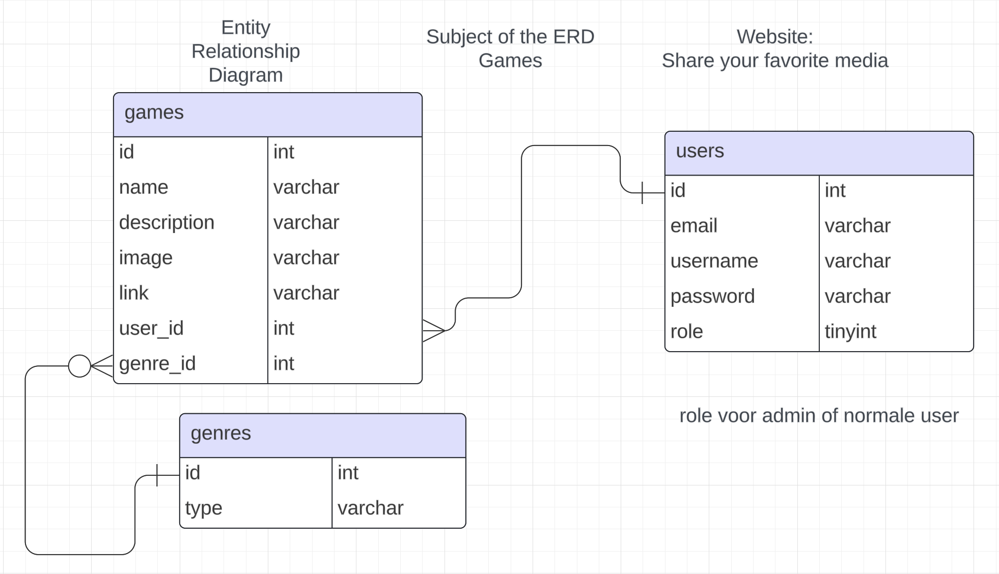
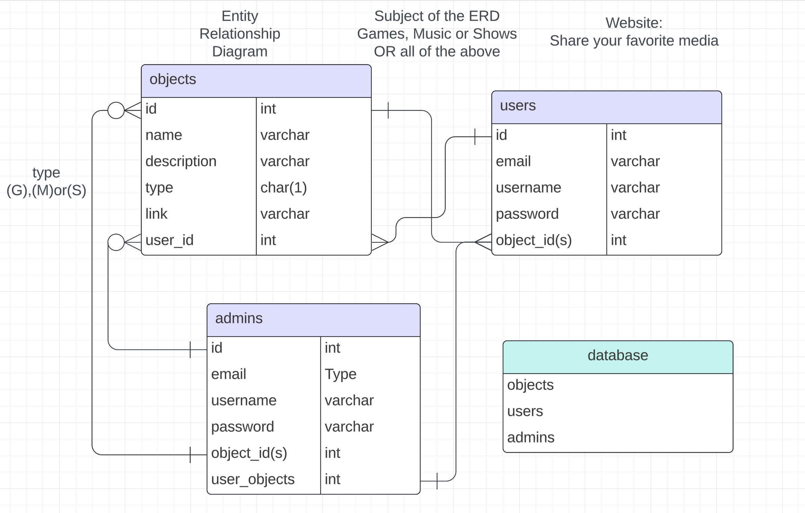
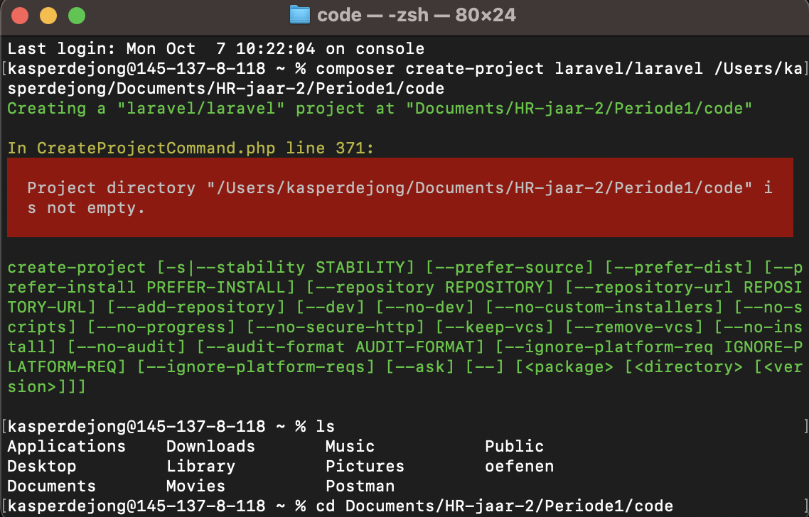
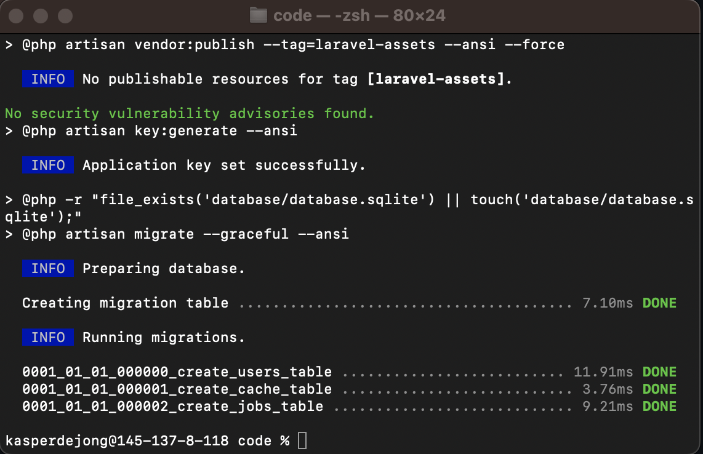
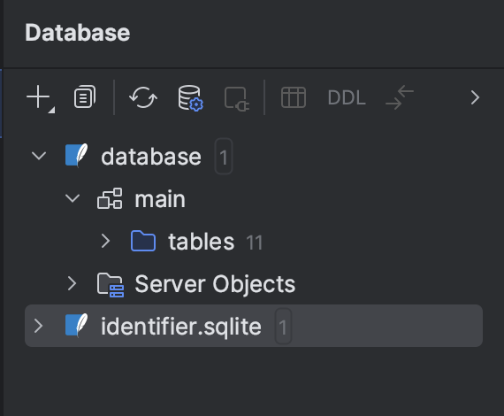
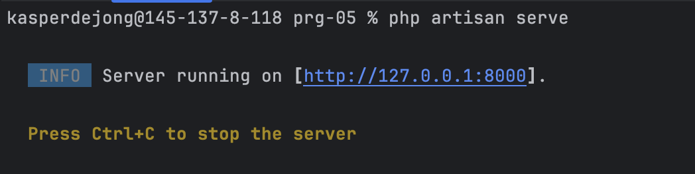
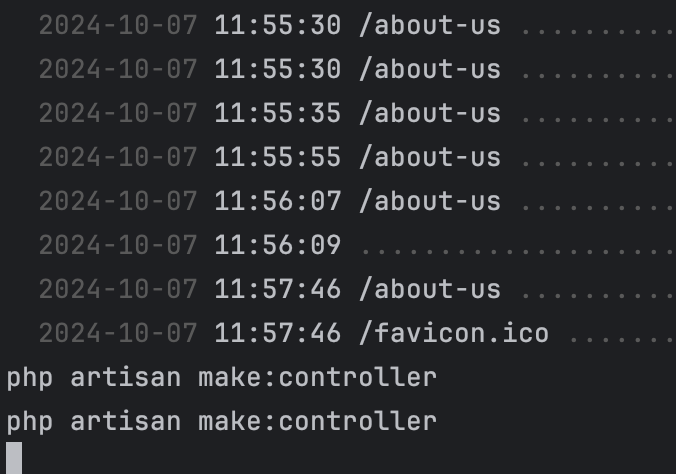

## Woensdag 23 Oktober

De site een beetje opgefrisd en gewerkt aan styling van de pages

## Donderdag 23 Oktober

Gezorgd dat de diepere validatie in de page zit.
Ik moet nu 3 games aanmaken voordat een hidden link tevoorschijn 
komt waar je ook alleen in mag als je 3 games hebt gemaakt .
Dit heb ik gedaan doormiddel van middleware

## Woensdag 23 Oktober

Admin game pagina toegevoegd
Nu kunnen items uit en aan gezet worden via de admin.games page

Filter toegevoegd aan mijn pagina.
Nu kan ik items tonen op basis van genre_id, naam, description en user op de games page.

Ook edit page en delete button beveiligd tegen intenties van andere users.

## Dinsdag 22 Oktober

Delete functionaliteit toegevoegd aan mijn gamespage
Edit functionaliteit toegevoegd aan mijn gamespage

OTAP onderzocht

## Maandag 21 Oktober

Gewerkt aan de images in de database krijgen en ze te tonen op de website.
Dit duurde uiteindelijk vrij lang.

Lesopdrachten gevolgd.

Lesopdracht 7.
Welke Controllers handelen de verschillende onderdelen van de authenticatie af? En waar staan deze?
- De auth controllers. Deze staan in de app/http/controllers/auth

Zoek uit welke URI's er zijn voor de verschillende onderdelen van de authenticatie. (Gebruik Artisan)
- php artisan route:list om te kijken waar de register page bijvoorbeeld heen gaat

Waar kan je deze URI's in de code vinden?
- Meestal zijn de routes aangemaakt onder de resource controller die je terug kan vinden in de php
route:list controller waarvoor je ook een blade view bestand aan moet maken

Hoe wordt er in de Views onderscheid gemaakt tussen een ingelogde en een niet ingelogde gebruiker?
- Met @auth()
  je bent ingelogd trouwens hahaha
  @endauth()
  @guest()
  jij bent niet ingelogd hoe durf je!
  @endguest()

Hoe wordt er voor gezorgd dat een Guest niet bij /profile kan komen?
- if (!$request->user() ||
  ($request->user() instanceof MustVerifyEmail &&
  !$request->user()->hasVerifiedEmail())) {
  // reject
  } In de middleware zet je dit. Zorg dat de email wordt geverifieerd

Hoe is de validatie bij login geregeld? Hoe wordt de oude waarde teruggegeven bij een foutieve invoer?

[//]: # (-         <label for="email">Email</label>)

[//]: # (        <input id="email" type="email" name="email" value="{{ old&#40;'email'&#41; }}" required autofocus>)

[//]: # (        @error&#40;'email'&#41;)

[//]: # (            {{ $message }})

[//]: # (        @enderror)
- met old() kan je je oude waarde teruggeven. 

Wat is hierin het verschil met /dashboard en /profile?
- De profile include ook nog dit @include('profile.partials.update-profile-information-form')
- En de dashboard geeft alleen maar informatie terug. {{ __("You're logged in!") }}

Hoe zijn formulieren beveiligd tegen Cross-Site Request Forgery (CSRF)? Staat dit op 1 plek?
- Je kan CSRF zetten boven je formulier en dan is de hele pagina gelijk beveiligd
- @csrf

Wat betekenen de {{ }} rond een variabele in de Views? Is er een alternatief?
- Dit is hetzelfde als de echo in php maar met dit hoef je php niet aan te roepen
- EN er wordt gelijk tegen sqlinjection beschermd. Het doet wat htmlentities doet.

Hoe zou je op role kunnen controleren, bijvoorbeeld voor het toelaten van een Admin?
- geef een role mee aan elke user en als dit niet qua cijfer overeenkomt zijn ze geen admin 
en worden ze niet toegelaten

## Vrijdag 18 Oktober

Gezorgd dat ik een genre kan kiezen bij de create page
en dat de user ook erbij wordt gezet.
Ik kan nu dingen opslaan in de database en het toont op de site

## Donderdag 17 Oktober

Foreign keys toegevoegd aan de games table.
Ook Genre.php en Game.php aan elkaar gekoppeld door 
middel van $this->hasMany en $this->belongsTo

## Dinsdag 15 Oktober

Een model aangemaakt.
Geleerd hoe ik in een database in sqlite info kan opslaan
informatie opgehaald doormiddel van een foreach loop en getoond
op de games page.
Tailwind aan de praat gekregen door het aan te zetten / te linken
in de layout. Thanks Antwan (dit moest ik vragen)
Mijn website mooier en overzichtelijker gemaakt.

## Maandag 14 Oktober

Vraag over niet kloppende naam project en github.
project updaten? push failed op zondag.
Ik en antwan hebben de fix gevonden op internet. moest iets curl'en de naam maakte niet uit

Feedback over ERD gevraagd. Admin tabel hoefde niet.
Ik heb een duidelijk onderwerp gekozen en de admins tabel naar genre veranderd en bijgewerkt
foto van de nieuwe en hopelijk uiteindelijke ERD

Verder in de code gewerkt aan x-layout en x-nav

## Zondag 13 Oktober

User stories: 
Als gebruiker wil ik objecten kunnen toevoegen op de website 
Must have (week van 14 okt)

Als gebruiker wil ik kunnen inloggen en mijn profiel kunnen bijhouden
Must have (week van 14 okt)

Ik wil weten waar de pagina over gaat door middel van een contact page
Should have (week van 14 okt / of niet)

Ik wil als actieve gebruiker een admin worden van de website met meer 
rechten dan de normale gebruiker
Must have (week van 21 okt)

Ik wil kunnen zoeken en filteren binnen alle objecten op de website
Should have (must voor de opdracht) (week van 14 okt)

Ik wil dat de pagina betrouwbaar en beveiligd is
Must have (gedurende het project bijhouden)

Ik wil mijn objecten actief en inactief kunnen zetten
Must have (week van 21 okt)

Ik wil dat de pagina niet voor bots of niet serieuze gebruikers
kan worden gebruikt, daarom wil ik dat alleen gebruikers die 3
objecten hebben gemaakt favorieten kunnen toevoegen.
Must Have (week van 21 okt)

Ik wil dat meerdere mensen online op de site kunnen en ermee
kunnen werken (week van 21 okt)
Could have

Ik wil dat SQL-injections niet mogelijk zijn op de website
Should have (gedurende het project)

Entity Relationship Diagram (ERD)

## Donderdag 10 Oktober

Goede start aan project.
Opdracht werkend en klaargezet.
Basic laravel Controllers en view gekoppeld.
Na vandaag kan ik aan de slag

## Dinsdag 8 Oktober

Andere Frameworks geïnstalleerd en uitgeprobeerd
Klaar met Ruby on Rails en klein begin CakePHP
Gewerkt aan projectdossier

## Maandag 7 Oktober

Voor de Laravel praktijk heb ik veel opgezet in phpstorm. Het eerste wat opviel was dit.
Een error tijdens het maken van het project.

Na feedback vragen aan de docent is het mij gelukt om het project goed aan te maken
door de naam goed mee te geven van het project wat ik wilde maken.
Ik dacht dat ik een bestaand project nodig had in de map maar dit was niet zo,
dus ik heb het gefixt en toen kon ik weer verder.

Ook had ik een klein probleempje met het toevoegen van de database sqlite.
Ik vroeg of ik de identifier zonder problemen weg kon doen aan antwan en dat was
zo dus ik heb dit gedaan.

Ik heb met de web.php gewerkt en heb mijn project aan de praat gekregen.
In de terminal heb ik de terminal laten runnen dus ik ben daar erg blij mee!

Voor de rest ging het redelijk goed tot het maken van de controller waar ik een beetje
moeite mee had maar dat was me uiteindelijk toch gelukt na een vraag aan antwan.
Ik moest een andere terminal met + aanmaken en het daar invoeren.

Nu weet ik wel beter hoe web.php werkt en hoe ik daarmee routes naar controllers kan aanroepen.
Die ik daarna in de browser kan tonen. Ik vond het schrijven van de code wel nog taai,
omdat ik nog niet weet hoe ik alles precies opschrijf en wat ik moet doen om een resultaat
te krijgen.
Maar ik verwacht dat dit beter zal gaan als ik hier meer ervaring mee opdoe in de komende
programmeer lessen.

# Hulp bij maken van changelog

Noteer je bevindingen.
Welke acties heb je ondernomen?
Noem je bronnen.
Wat verliep goed? Wat was lastig?
Wat heb je geleerd?
Gebruik screenshots om je bevindingen te ondersteunen.
🗣️ Noteer de feedback die je van je docent hebt gekregen.

# H1

3 of meer posts voor diepere validatie

MAAK ROLE 1 ADMIN in de database. ALLEEN IK MAG KIEZEN WIE ADMIN IS.
standaard user is 2 en die kan dit niet.
  
{{ $slot }} doet AUTOMATISCH HTMLentities, dus beveiling tegen cross side scripting

? : notatie is een if else maar dan CLEAN
let op je migrations. Als je geen product_id hebt of dat tabel niet
heb kan je ook geen review table maken waarin je het product_id nodig hebt.

OWASP: Hoe regelt LARAVEL deze security

pas op met cascadeOnDelete, want je kan het niet terugkrijgen.
maar als je bijvoorbeeld reviews van een verwijderd product wilt wegdoen is het handig.

@csrf voor formulier als je error krijgt 419 page expired.
En het beveiligd.
zet dit gewoon boven de form het hoeft nergens in.

dd voor checken van forms en andere zaken op de website
dd($request)
dd($jouwdingetje)

hou config dicht hoge kans dat die niet gebruikt hoeft te worden
en NIKS doen met node_modules. Dit zijn gegenereerde bestanden
voor de werking van de map.
tests kunnen we negeren op deze opleiding NOOIT openen.
 * opsomming
 * sdfsds
 
